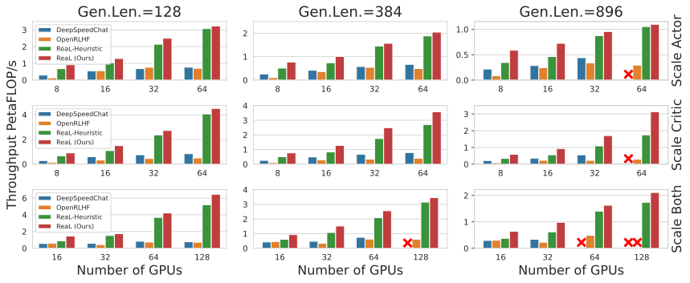

<p align="center">
  <picture>
    <source media="(prefers-color-scheme: dark)" srcset="docs/source/images/real_logo_dark.svg">
    
  </picture>
</p>

<p align="center">
| <a href="https://openpsi-project.github.io/ReaLHF/"><b>Documentation</b></a> | <a href="https://arxiv.org/abs/2406.14088"><b>Paper</b></a> |
</p>

<h1 align="center">
<em>ReaL</em>: Efficient RLHF Training for LLMs <br>with Parameter Reallocation
</h1>

***ReaL*** (short for *<ins>ReaL</ins>location*) is a distributed system designed for efficient RLHF training with LLMs. This is the library used to run experiments for the ICML 2024 Oral Paper [Is DPO Superior to PPO for LLM Alignment? A Comprehensive Study](https://arxiv.org/pdf/2404.10719). 

ReaL introduces a novel approach called *parameter reallocation*, which dynamically redistributes LLM parameters across the cluster and adapts parallelization strategies during training. By optimizing allocations and parallelism for each computation workload, ReaL achieves significantly higher PPO training throughput compared to state-of-the-art open-source systems.

(In the following figure, as the number of GPUs increases, the model size scales up from LLaMA 7B, LLaMA 13B, and CodeLLaMA 34B, to the largest LLaMA 70B.)



## News 📢

- **[2024/09/05]** Releasing ReaL v0.3.0 - MoE RLHF, CUDAGraph generation, mini-batched execution, and more customized algorithms.

## Features

- Large-scale and high-throughput SFT/reward modeling/DPO/PPO/generation.
- MoE model training and generation.
- PPO tricks, e.g. GAE, advantage/value normalization, and reference EMA.
- State-of-the-art RLHF algorithms, e.g., [GRPO](https://github.com/openpsi-project/ReaLHF/tree/main/examples/new_algorithms/grpo).

## Highlights

### 🚀 Efficiency

- Achieves state-of-the-art training throughput for RLHF using **parameter reallocation**.
- Supports high-throughput generation with CUDAGraph and large-scale training with 3D parallelism.
- Enables memory-efficient training with parameter and optimizer offloading.

### ✨ Ease of Use

- Seamlessly integrates with HuggingFace checkpoints and inference frameworks like vLLM. No checkpoint conversion required.
- Allows launching local or distributed experiments via [Ray](https://docs.ray.io/en/latest/index.html) or [SLURM](https://slurm.schedmd.com/documentation.html) with a single command.

Check out our [tutorial](https://openpsi-project.github.io/ReaLHF/quickstart.html) to reproduce the full RLHF procedure (SFT/RW/PPO) with 4×LLaMA-7B in just **30 minutes**.

### 🎯 Flexibility

- Offers versatile configuration customization with Hydra structured config.
- Supports many commonly used RLHF algorithms, including DPO, PPO, RAFT, and more.
- Allows the addition of custom algorithms (e.g, [ReMax](https://github.com/openpsi-project/ReaLHF/tree/main/examples/new_algorithms/reinforce), [GRPO](https://github.com/openpsi-project/ReaLHF/tree/main/examples/new_algorithms/grpo), [Reference Model EMA](https://github.com/openpsi-project/ReaLHF/blob/main/examples/customized_exp/ppo_ref_ema.py) or [external reward signal](https://github.com/openpsi-project/ReaLHF/blob/main/examples/customized_exp/ppo_sentiment.py)) while maintaining high efficiency with ReaL's infrastructure.

Refer to our [customization guide](https://openpsi-project.github.io/ReaLHF/customization.html) for [hands-on examples](https://github.com/openpsi-project/ReaLHF/tree/main/examples/new_algorithms/).

## Getting Started

We provide pre-built [Docker images](https://openpsi-project.github.io/ReaLHF/install.html#docker-images) and [PyPI packages](https://openpsi-project.github.io/ReaLHF/install.html#install-from-pypi-or-source). To use the latest version of our code, please install from the source (see detailed installation instructions [here](https://openpsi-project.github.io/ReaLHF/install.html#)):

```bash
git clone https://github.com/openpsi-project/ReaLHF
cd ReaLHF
pip install -r requirements.txt
export MAX_JOBS=8

# GPU dependencies, not required on the launcher node.
pip install git+https://github.com/NVIDIA/TransformerEngine.git@v1.8 --no-deps --no-build-isolation
pip install flash_attn==2.4.2 --no-build-isolation 
pip3 install git+https://github.com/tgale96/grouped_gemm.git@v0.1.4 --no-build-isolation --no-deps  # For MoE

REAL_CUDA=1 pip install -e . --no-build-isolation
```

For detailed information, please visit our [documentation site](https://openpsi-project.github.io/ReaLHF/).

- [Quickstart](https://openpsi-project.github.io/ReaLHF/quickstart.html)

- [Experiment Configurations](https://openpsi-project.github.io/ReaLHF/expconfig.html)

- [Code Architecture](https://openpsi-project.github.io/ReaLHF/arch.html)

- [Contributing](https://openpsi-project.github.io/ReaLHF/contributing.html)

## Acknowledgement

We would like to thank the authors of our paper and the following individuals for their contributions: Shusheng Xu and Jiaxuan Gao from Tsinghua University, and Weilin Liu, Wenjie Ye, and Chuyi He from OpenPsi Inc, for thoroughly testing and using ReaL in their research, and for providing valuable suggestions that greatly improved the system.

We also extend our gratitude to following open-source LLM projects for providing references for our implementation:

- [Megatron-LM](https://github.com/NVIDIA/Megatron-LM) for TP/EP modules and the distributed optimizer

- [DeepSpeed](https://github.com/microsoft/DeepSpeed) for ZeRO and ZeRO-offload

- [vLLM](https://github.com/vllm-project/vllm) for custom all-reduce and CUDA graph

## Citation

If you find our system useful for your research or production, please cite our papers.

```
@article{mei2024realhf,
  title={ReaLHF: Optimized RLHF Training for Large Language Models through Parameter Reallocation},
  author={Mei, Zhiyu and Fu, Wei and Li, Kaiwei and Wang, Guangju and Zhang, Huanchen and Wu, Yi},
  journal={arXiv preprint arXiv:2406.14088},
  year={2024}
}
```

```
@article{xu2024dpo,
  title={Is dpo superior to ppo for llm alignment? a comprehensive study},
  author={Xu, Shusheng and Fu, Wei and Gao, Jiaxuan and Ye, Wenjie and Liu, Weilin and Mei, Zhiyu and Wang, Guangju and Yu, Chao and Wu, Yi},
  journal={arXiv preprint arXiv:2404.10719},
  year={2024}
}
```