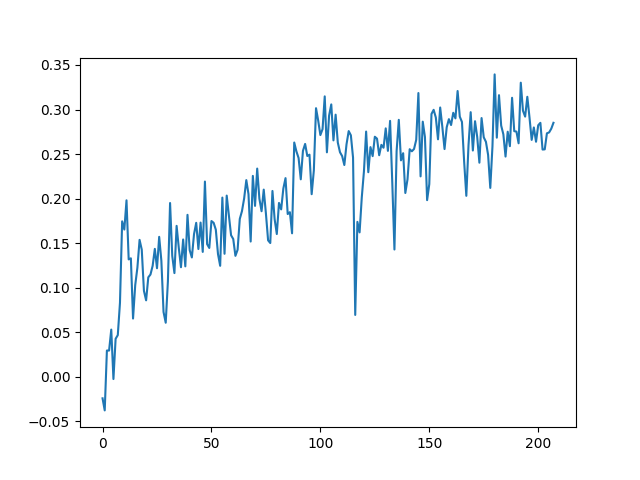

# A Distributed System for LLM RLHF

## Contributing

Before reading the code, keep in mind that:
1. Everything in [api/config.py](api/config.py) are configurations. They are used to configurate your experiment.
2. Other classes in [api directory](api/) are abstract methods. They represent necessary components for the system to run.
3. Classes in [api/config.py](api/config.py) and other scripts in [api directory](api/) may have same class names. 

See `docs/user_guide`.

To understand difference between `model`, `model backend` and `model interface`, read [this doc](docs/user_guide/02_model.md).

## Step 1: Train A Reward Model

Command
```
python3 -m apps.main start -e wps-rw-pl-s1 -f ${your_trial_name} --mode slurm --wandb_mode disabled
```

This will train a Plackett-Luce reward model based on give positive and negative examples.

See `ExcelPlackettLuceRewardDataset` in `impl/data/wps_dataset.py` for the used dataset.

See `WPSPlackettLuceRewardInterface` in `impl/model/interface/wps_actor_critic.py` for the algorithm implementation.

The trained model will be saved in the subfolders of `/data/aigc/llm/checkpoints/${USER}/wps-rw-pl-s1/${your_trial_name}/default/epoch4step0/`.

## Step 2: RLHF

Command
```
python3 -m apps.main start -e wps-rlhf -f ${your_trial_name} --wandb_mode disabled --mode slurm
```

Remember to replace the default actor model and reward model to yours.

Check the logs hinted by stdout for detailed training information.

There are some scripts to wash data based on heuristics in `scripts/data`.

## Reward vs Training Steps


