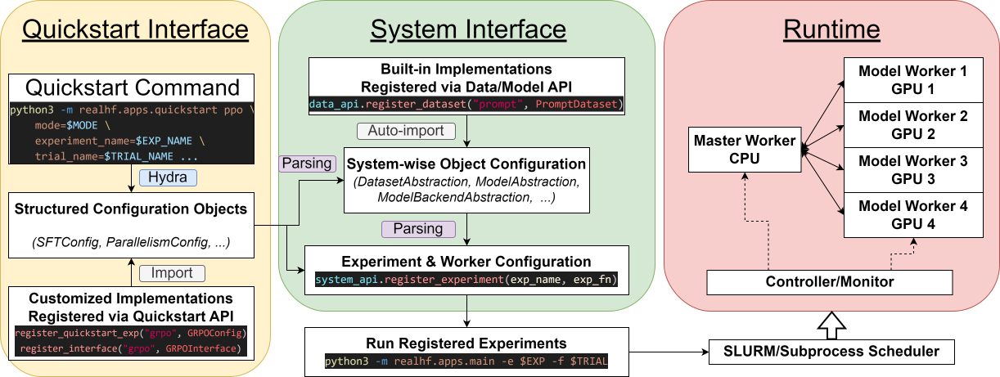

###############
 Core Concepts
###############

**************************
 Algorithm Representation
**************************

An algorithm in ReaL are represented as a *dataflow graph*, where each
node is a *model function call* (e.g., generate, inference, or
train_step called on an LLM) and each edge specifies the data or
parameter version dependency between two nodes.

For example, the dataflow graph of PPO is shown below:

   The dataflow graph of PPO.

We show another example of the so called `ReMax
<https://arxiv.org/abs/2310.10505>`_ or REINFORCE algorithm below:

   The dataflow graph of ReMax.

Only data dependencies are shown in the above figures. Parameter version
dependencies are enforced such that the first call to a model X at step
i is always followed by the last call to X at step i-1.

Note that under this representation, SFT or reward modeling degenerates
to a single node.

.. note::

    ReaL can efficiently handle arbitrary dataflow graphs composed of generate, inference, or train_step model function calls
    by parallelizing the intra-node and inter-node computation across multiple GPUs.

Each node in the dataflow graph is represented by a :class:`realhf.MFCDef` object.

************************
 Runtime Infrastrcuture
************************

ReaL implements a worker-based runtime, composed of a single
MasterWorker on CPU, and multiple ModelWorkers, each occupying a
separate GPU. The MasterWorker runs

******************************************
 The Procedure of Launching an Experiment
******************************************

   The execution workflow when launching an experiment with ReaL.

ReaL has two levels of configurations. The outer level is based on the
Hydra structured configuration, as we illustrated in the
:doc:`quickstart` section. This level abstracts an experiment into
several configurable fields, which makes the user to conveniently change
the hyperparameters of the experiment, such as the parallelism strategy,
the learning rate, and the batch size.

This configuration is then translated into a worker-level experiment
configuration, i.e., ``realhf.api.core.system_api.ExperimentConfig``,
which is the inner level. This object is composed of the runtime
configurations of individual workers. It includes the dataset, model,
interface, and backends to run on each model worker. For example,
ModelWorker i runs a shard of the Actor with parallelism rank (DP=1,
TP=0, PP=2) and a shard of the Critic with parallelism rank (DP=0, TP=1,
PP=0), while ModelWorker j runs a single shard of the Reward with
parallelism rank (DP=0, TP=0, PP=0). This
