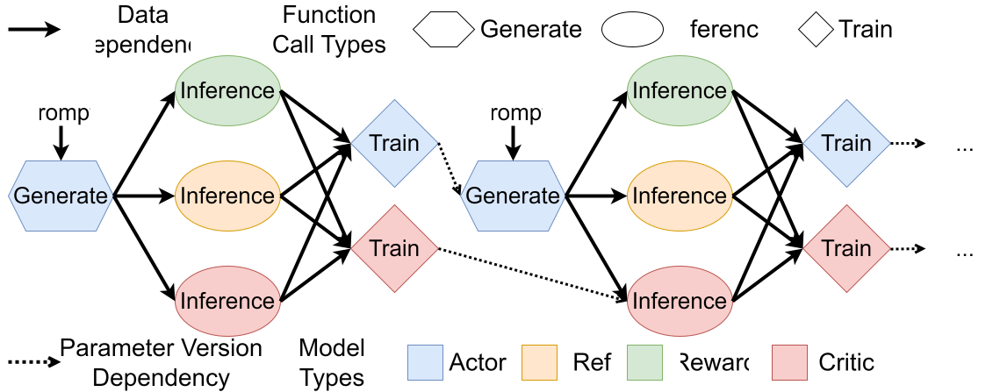

###############
 Customization
###############

**********************
 Customizing Datasets
**********************

Overview
========

We provide three types of dataset implementations in
``realhf/impl/dataset/`` with the following configurations:

-  :class:`realhf.PromptAnswerDatasetConfig`
-  :class:`realhf.PairedComparisonDatasetConfig`
-  :class:`realhf.PromptOnlyDatasetConfig`

Datasets in ReaL are commonly used `PyTorch map-style datasets
<https://pytorch.org/docs/stable/data.html#map-style-datasets>`_. Users
need to implement a ``__getitem__`` method in the dataset class, which
returns a :class:`realhf.SequenceSample` object containing the data of a
single sample and its sequence length. The sequence length is necessary
because ReaL uses variable-length inputs without padding to save GPU
memory.

The Data Structure: :class:`realhf.SequenceSample`
==================================================

ReaL follows `the API of flash_attn_varlen_func
<https://github.com/Dao-AILab/flash-attention/blob/main/flash_attn/flash_attn_interface.py#L1053>`_
to handle variable-length inputs without padding. The class
:class:`realhf.SequenceSample` is used to store the lengths and data of
sequences, facilitating gather, split, and data transfer operations on
these variable-length datasets.

The core fields of :class:`realhf.SequenceSample` are:

-  ``ids``: A list of unique hashable identifiers for each data piece.
   The length of ``ids`` corresponds to the batch size.

-  ``keys``: A set of strings representing the keys loaded from the
   dataset or produced by model function calls. Each key can contain
   multiple sequences, such as multiple responses generated from the
   same prompt. Sequences with the same key are packed together, with a
   vector representing their lengths.

-  ``seqlens``: A dictionary of lists, where each list corresponds to
   the sequence lengths of the data specified by the key. The length of
   the lists should be equal to the batch size. The elements in the list
   should be 1D ``torch.IntTensor``. The tensor size equals the number
   of sequences packed for each key. For example, if there are K
   responses for each prompt, each tensor in the "response" list should
   have size (K,), and each tensor in the "prompt" list should have size
   (1,).

-  ``data``: A dictionary of PyTorch tensors. All data are packed into
   1D tensors with size (total_seqlen, ). The outer packing dimension
   represents the batch size, while the inner packing dimension
   represents the number of sequences for each key.

Below is an example implementation of the dataset used for reward
modeling:

.. code:: python

   def __getitem__(self, idx):
        ...
        return data_api.SequenceSample(
            keys=["packed_input_ids", "prompt_lens"],
            data=dict(
                  packed_input_ids=torch.tensor(packed_input_ids, dtype=torch.long),
                  prompt_lens=torch.tensor([prompt_len], dtype=torch.int32),
            ),
            ...
            ids=[self.ids[idx]],
            seqlens=dict(
                packed_input_ids=[torch.tensor(input_lens, dtype=torch.int32)],
                prompt_lens=[torch.tensor([1], dtype=torch.int32)],
            ),
        )

In this example, the returned sample has a batch size of 1, with two
keys: "packed_input_ids" and "prompt_lens". The "packed_input_ids" key
contains packed positive and negative responses, with their lengths
specified by the vector "input_lens". The "prompt_lens" key contains a
scalar tensor representing the length of the prompt, with a length of 1.

Note that the ``ids`` and ``seqlens`` fields are wrapped in length-1
lists, indicating that the batch size is 1.

For more details, please refer to :class:`realhf.SequenceSample` and the
implementation of datasets under the ``realhf/impl/dataset`` folder.

How Dataset Configuration is Parsed
===================================

We will use the SFT experiment as an example.

The :class:`realhf.PromptAnswerDatasetConfig` object will be converted
to a dataset configuration under the system API, specifically
``realhf.api.core.config.DatasetAbstraction``. This object includes a
dataset name (in this case, "prompt_answer") and corresponding arguments
that are passed to the dataset class's constructor:

.. code:: python

   @property
    def datasets(self):
        return [
            DatasetAbstraction(
                "prompt_answer",
                args=dict(
                    max_length=self.dataset.max_seqlen,
                    dataset_path=self.dataset.train_path,
                ),
            )
        ]

At the end of ``realhf.impl.dataset.prompt_answer_dataset``, we find the
following line:

.. code:: python

   data_api.register_dataset("prompt_answer", PromptAnswerDataset)

This line registers the dataset class with the system API. When the name
"prompt_answer" name is provided to the system API, ReaL can locate this
dataset implementation and construct it. The ``args`` field in
``DatasetAbstraction`` will be passed to the ``__init__`` method of the
dataset class, except that ReaL reserves a ``util`` field to store some
utility objects.

Steps for Implementing a New Dataset
====================================

#. Create a new dataset file under ``realhf/impl/dataset/``.

#. Implement a map-style PyTorch dataset class with a ``__getitem__``
   method. This method should return a :class:`realhf.SequenceSample`
   object containing the sequence length as metadata.

#. Register the class with ``data_api.register_dataset`` at the end of
   the file, e.g., using the name "my-dataset".

#. Check your dataset implementation by running the unit test in
   ``tests/data/test_load_data.py``. Please implement a new test
   function for your customized dataset class by imitating existing
   ones.

#. Update the name of the dataset in experiment configurations, for
   example, in the ``datasets`` method of :class:`realhf.SFTConfig`, to
   "my-dataset".

#. If you need to pass additional arguments to construct the dataset
   class, modify the quickstart configuration class (in this case,
   ``realhf.PromptAnswerDatasetConfig``) as well as the ``args`` field
   in the ``DatasetAbstraction`` object.

********************
 Customizing Models
********************

Overview
========

For efficiency reasons, ReaL does not support every transformer model
from the HuggingFace model hub. In ReaL, we implement the
:class:`realhf.impl.model.nn.real_llm_api.ReaLModel` class that wraps
the HuggingFace model and provides micro-batched pipelining, offload,
and parameter reallocation functionalities. It's a decoder-only dense or
Mixture-of-Expert (MoE) transformer model.

There are helper functions in the model API used to convert HuggingFace
models back and forth, such as ``from_llama`` and ``to_llama``. These
helper functions are generated automatically by registering conversion
functions in the ``api/from_hf/`` folder.

For example, consider ``api/from_hf/llama.py``. To register a
convertible HuggingFace model, the user should implement:

-  Two functions to convert model configs between HuggingFace and
   :class:`realhf.ReaLModelConfig`.

-  Two functions to convert model state dicts between HuggingFace and
   ReaL, primarily involving key remapping. Importantly, these functions
   should be able to *remap any subset of model parameters* due to the
   use of 3D parallelism in ReaL.

-  Three functions specifying the names of parameters in the embedding
   layer, transformer blocks, and the output layer, respectively. These
   functions are used to selectively load checkpoints with 3D
   parallelism.

.. note::

   The actual save/load funcion is implemented in
   ``realhf/impl/model/conversion/hf_registry.py``.

Steps to Support a New HuggingFace Model
========================================

-  Create a new model file under ``api/from_hf/``.
-  Implement the required helper functions as described above.
-  Register the model with register_hf_family at the end of the file.
-  Test the consistency of the implemented model with scripts in
   ``tests/model/test_cpu_inference.py``.

************************
 Customizing Algorithms
************************

Overview
========

In ReaL, algorithms are represented as dataflow graphs. Each node in the
graph corresponds to a model function call (MFC), which can be one of
the generate, inference, or train requests applied to a specific model
(e.g., Actor or Critic). The edges in the graph indicate data or
parameter version dependencies between nodes.

The following figure illustrates the dataflow graph of PPO:

A node is represented by a :class:`realhf.MFCDef` object. Each node has
a ``model_name`` field and an ``interface_type`` field, which specify
what the node should conceptually do during execution. The
``interface_impl`` field specifies the actual implementation of the
model interface.

The interface class has the following signature:

.. autoclass:: realhf.ModelInterface
   :no-index:
   :members:
   :undoc-members:

During the execution of an MFC node, the model identified by
``model_name`` is passed into this interface object, along with the data
specified in the MFC node.

.. note::

   Similar to datasets, model interfaces are registered and constructed
   by the system API. Please check
   ``impl/model/interface/sft_interface.py`` for an example. The
   ``SFTInterface`` is registered at the end of this file and
   constructed by :class:`realhf.SFTConfig` (see the ``rpcs`` method).

Running algorithms in ReaL involves executing a large dataflow graph
that concatenates all the training iterations. The *MasterWorker*
monitors the state of this graph and issues MFC requests to
*ModelWorkers* once the dependencies are satisfied.

..
   For more details about the code architecture, please refer to the :doc:`arch` page.

Example: A Customized Reward Function for PPO
=============================================

In this example, we demonstrate how to use a customized reward model
from HuggingFace in a PPO experiment when the model is not supported by
``ReaLModel``.

The example code can be found in ``examples/ppo_sentiment.py``, where we
replace the trained reward model for sentiment generation with a
BERT-like sentiment analysis model from HuggingFace.

First, we need to implement a new model interface class for our
customized use:

.. code:: python

   @dataclasses.dataclass
   class SentimentScoringInterface(model_api.ModelInterface):

       def __post_init__(self):
           super().__post_init__()
           self.score_model = (
               transformers.AutoModelForSequenceClassification.from_pretrained(
                   "/path/to/score_model"
               ).cuda()
           )
           self.score_model.eval()
           self.score_tokenizer = transformers.AutoTokenizer.from_pretrained(
               "/path/to/score_model"
           )

       @torch.no_grad()
       def inference(
           self, model: model_api.Model, input_: SequenceSample
       ) -> SequenceSample:
           # Re-tokenize the texts.
           texts = model.tokenizer.batch_decode(input_ids, skip_special_tokens=True)
           encoding = self.score_tokenizer(
               texts, return_tensors="pt", padding=True, truncation=True
           )

           # Perform inference to get the score.
           # For IMDB, 0 is negative and 1 is positive. We record the logits of the positive class.
           logits = self.score_model(
               input_ids=encoding["input_ids"].cuda(),
               attention_mask=encoding["attention_mask"].cuda(),
           ).logits
           # For IMDB, 0 is negative and 1 is positive. We record the logits of positive.
           scores = logits[..., -1].contiguous().float()

           res = SequenceSample.from_default(
               ids=input_.ids,
               seqlens=[1 for _ in range(bs)],
               data=dict(rewards=scores),
           )
           return res

Key points in this code:

-  During interface initialization, we load a HuggingFace model and its
   tokenizer.
-  During inference, we re-tokenize the generated output from the Actor,
   compute the score, and return it.

Now, we need to register this interface in the system API:

.. code:: python

   model_api.register_interface("sentiment_scoring", SentimentScoringInterface)

To use our customized interface implementation in PPO, we need to change
the ``interface_impl`` field of the reward model in the MFC nodes of
PPO:

.. code:: python

   class MyPPOConfig(PPOConfig):

       def initial_setup(self) -> ExperimentConfig:
           ...
           for mw in cfg.model_worker:
               for s in mw.shards:
                   if s.id.model_name.role == "reward":
                       # Remove the original reward model because we are using a customized one.
                       s.model = config_api.Model(
                           "tokenizer",
                           args=dict(
                               tokenizer_path=self.rew.path,
                           ),
                       )
                       s.backend = config_api.ModelBackend("null")
           # Change the MFC of Reward.
           idx = 0
           for rpc in cfg.model_rpcs:
               if rpc.model_name.role == "reward":
                   break
               idx += 1
           inf_reward_rpc = cfg.model_rpcs[idx]
           inf_reward_rpc.interface_impl = config_api.ModelInterfaceAbstraction(
               "sentiment_scoring"
           )
           inf_reward_rpc.post_hooks = []
           return cfg

Don't forget to register your customized experiment configuration so
that ReaL can launch it with the quickstart command line options:

.. code:: python

   register_quickstart_exp("my-ppo", MyPPOConfig)

Finally, let's run the customized experiment with the quickstart
command:

.. code:: console

   # Note that we change the name "ppo" to "my-ppo"
   python3 -m realhf.apps.quickstart my-ppo \
       experiment_name=sentiment-ppo \
       trial_name=test \
       ppo.kl_ctl=0.1 \
       ppo.top_p=0.9 ppo.top_k=1000 \
       ...

This example is also applicable for scenarios where you want to use an
external reward, such as a signal from a compiler or other online
automatic evaluations.

..
   Example 2: Develop a new dataflow

..
   ~~~~~~~~~~~~~~~~~~~~~~~~~~~~~~~~~~~~~~~~~~~~~~~~~~~~~~~~~~~~~~~~~~~

..
   TODO
