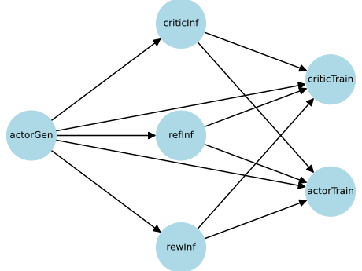
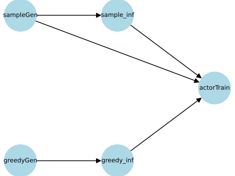
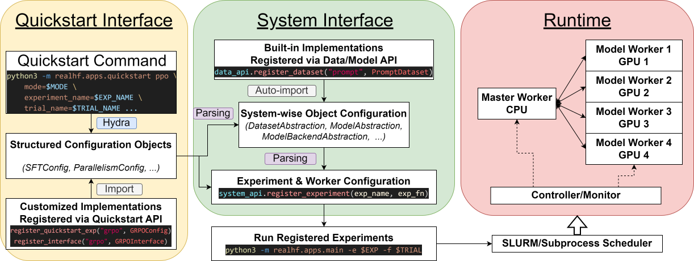

########################
 Implementation Details
########################

**************************
 Algorithm Representation
**************************

An algorithm in ReaL is represented as a *dataflow graph* (DFG), where
each node is a *model function call* (MFC, e.g., generate, inference, or
``train_step`` called on an LLM), and each edge specifies the data or
parameter version dependency between nodes.

The dataflow graph of PPO looks like this:

   The dataflow graph of PPO.

Below, we show another example of the `ReMax
<https://arxiv.org/abs/2310.10505>`_, also known as the REINFORCE
algorithm:

   The dataflow graph of ReMax, or REINFORCE.

.. note::

   In this representation, the dataflow graph of pre-training, SFT, or
   reward modeling simplifies to a single ``train_step`` node.

More examples can be found in the ``docs/images/dfg`` folder. Only data
dependencies are shown in the figures above. Parameter version
dependencies are enforced so that the first call to a model X at step i
is always preceded by the last call to X at step i-1.

These figures are generated by a standalone script,
``examples/visualize_dfg.py``. For a given algorithm, such as PPO, we
decompose the entire dataflow into individual MFCs, each represented by
a :class:`realhf.MFCDef` object. The input and output keys of each model
function call specify their data dependencies. A list of
:class:`realhf.MFCDef` objects is passed into the ``build_graph``
function to construct a dataflow graph, which is an instance of
``networkx.DiGraph``.

A device mesh D is the unit used for executing an individual function
call. It is defined as a two-dimensional grid of GPUs located in the
cluster. The shape of D is denoted as (N, M), where it covers N nodes
equipped with M devices. Note that device meshes with the same shape
could have different locations.

The i-th MFC node will be executed on the device mesh :math:`D_i`.
**This mesh can either be disjoint from or overlap with the device
meshes of other MFCs.**

.. note::

   We assume that :math:`D_i` either covers several entire hosts or a
   consecutive portion capable of dividing the number of devices on one
   host, e.g., (1, 1), (1, 2), (1, 4), (1, 8), (2, 8), ..., (N, 8) in a
   cluster of (N, 8).

For example, this `PPO training script
<https://github.com/openpsi-project/ReaLHF/blob/main/examples/scripts/local/ppo_manual.sh>`_
manually allocates all six MFCs to different device meshes with
different parallel strategies. In particular, we have a (1, 8) global
device mesh. We denote GPUs as g0, g1, ..., g7.

-  Actor generation will run on all 8 GPUs, with a parallel strategy of
   (DP=4, TP=1, PP=2).
-  Critic inference will run on [g0, g1], with a parallel strategy of
   (DP=2, TP=1, PP=1).
-  Reward inference will run on [g2, g3], with a parallel strategy of
   (DP=1, TP=1, PP=2).
-  Reference inference will run on [g4, g5, g6, g7], with a parallel
   strategy of (DP=1, TP=1, PP=4).
-  Critic training will run on [g4, g5, g6, g7], with a parallel
   strategy of (DP=2, TP=1, PP=2).
-  Actor training will run on [g0, g1, g2, g3], with a parallel strategy
   of (DP=2, TP=1, PP=2).

Under this allocation, inference and training can be executed
concurrently on disjoint device meshes, while generation uses the whole
device mesh to maximize throughput.

From the perspective of GPUs,

-  g0 and g1 hold the first half layers of the actor for training.
   Besides, the critic model will be reallocated from CPU to g0 upon
   inference.

-  g2 holds the second half layers of the actor for training. Besides,
   the first half layers of the actor will be reallocated upon
   generation, and the first half layers of the reward model will be
   reallocated upon inference.

-  g3 holds the second half layers of the actor for training. Besides,
   the first half layers of the actor will be reallocated upon
   generation, and the second half layers of the reward model will be
   reallocated upon inference.

-  g4 holds the first half layers of the critic for training. Besides,
   the first quarter layers of the reference model will be reallocated
   upon inference, and the second half layers of the actor will be
   reallocated upon generation.

-  g5 holds the first half layers of the critic for training. Besides,
   the second quarter layers of the reference model will be reallocated
   upon inference, and the second half layers of the actor will be
   reallocated upon generation.

-  g6 holds the second half layers of the critic for training. Besides,
   the third quarter layers of the reference model will be reallocated
   upon inference, and the second half layers of the actor will be
   reallocated upon generation.

-  g7 holds the second half layers of the critic for training. Besides,
   the last quarter layers of the reference model will be reallocated
   upon inference, and the second half layers of the actor will be
   reallocated upon generation.

The graph building is performed in ``realhf/api/core/system_api.py``
during the post-initialization of experiment configurations. The
concrete definitions of MFCs in different experiments can be found in
files under ``realhf/experiments/common/``. All experiment
configurations define an ``rpcs`` property, which is first processed by
the ``initial_setup`` method in ``realhf/experiments/common/common.py``
and then passed to the ``ExperimentConfig`` object to build the graph.

**********************
 Parallelism Strategy
**********************

Suppose we have a cluster with the dimensions (N, M), where N is the
number of nodes and M is the number of GPUs per node. ReaL will launch N
* M model worker processes, each exclusively occupying a GPU. These
processes will share a global PyTorch process group, and each MFC will
create sub-groups on their respective device meshes. Furthermore, the
data, tensor, and pipeline parallel groups are created within each
sub-group, similar to Megatron-LM. These groups will be kept in
`constants.py
<https://github.com/openpsi-project/ReaLHF/tree/main/realhf/base/constants.py>`_
as per-process global constants.

When different MFCs are executed on the same GPU (i.e., their device
meshes are overlapped), ReaL switches the process group by using a
``model_scope`` context defined in `constants.py
<https://github.com/openpsi-project/ReaLHF/tree/main/realhf/base/constants.py>`_.
The model name is provided by the MFC. Within the scope, the 3D
parallelism groups specifically refer to the groups of this MFC.
Otherwise, the DP/TP/PP parallelism group could not be accessed.

There are three levels of process groups in ReaL. The innermost level is
the data/tensor/pipeline parallel group for a specific MFC. The
intermediate level is each MFC's sub-group. The outermost level is the
global PyTorch global group created by ``dist.init_process_group``.

The conversion from the innermost level to the intermediate level is
handled by the ``ProcessTopology`` class in `topology.py
<https://github.com/openpsi-project/ReaLHF/tree/main/realhf/base/topology.py>`_,
and the conversion from the intermediate level to the outermost level is
managed by the ``rank_mapping`` dictionary in `constants.py
<https://github.com/openpsi-project/ReaLHF/tree/main/realhf/base/constants.py>`_.

For example, suppose we have a 2x8 device mesh two MFCs. MFC#1 occupies
the last 1x8 GPUs, aka the second node, and MFC#2 occupies all 2x8 GPUs.
MFC#1 has a parallel strategy of (DP=2,TP=2,PP=2), and MFC#2 has a
parallel strategy of (DP=4,TP=4,PP=1). Denote the GPUs on the first node
as [g0, ..., g7] and the GPUs on the second node as [g8, ..., g15]. The
following process groups will be created:

-  The global group: [g0, g1, g2, ..., g15], aka all GPUs.
-  MFC#1's sub-group: [g8, g9, g10, g11, g12, g13, g14, g15], aka the
   second node.
-  MFC#2's sub-group: [g0, g1, g2, ..., g15], aka all GPUs. This is a
   virtual group and ReaL will just use the global group when we use it.
-  MFC#1's 4 pipeline parallel groups: [g8, g12], [g9, g13], [g10, g14],
   [g11, g15].
-  MFC#1's 4 tensor parallel groups: [g8, g9], [g10, g11], [g12, g13],
   [g14, g15].
-  MFC#1's 4 data parallel groups: [g8, g10], [g9, g11], [g12, g14],
   [g13, g15].
-  MFC#2's pipeline parallel group: [g0, g1, ..., g15]. This is also a
   virual group.
-  MFC#2's 4 tensor parallel groups: [g0, g1, g2, g3], [g4, g5, g6, g7],
   [g8, g9, g10, g11], [g12, g13, g14, g15].
-  MFC#2's 4 data parallel groups: [g0, g4, g8, g12], [g1, g5, g9, g13],
   [g2, g6, g10, g14], [g3, g7, g11, g15].

The rank mapping from MFC1 to the global group is

.. code:: python

   {0: 8, 1: 9, 2: 10, 3: 11, 4: 12, 5: 13, 6: 14, 7: 15}

and the rank mapping of MFC2 is an identical mapping.

************************
 Runtime Infrastructure
************************

ReaL implements a worker-based runtime, consisting of a single
MasterWorker (MasW) on the CPU and multiple ModelWorkers (ModW), each
occupying a separate GPU. For example, in a cluster of (N, 8), there
will be one MasW and N * 8 ModWs.

Overview
========

Recall that MFCs can have independent (either disjoint or overlapping)
device meshes. From the perspective of a ModW or a GPU, it can host one
or more MFCs. The MasW will execute the DFG and send requests to the
corresponding handlers. Each request contains the handler name (e.g.,
Actor or Critic), the interface type (e.g., ``generate`` or
``train_step``), and some metadata (e.g., the input and output keys).
Upon receiving the request, the ModW will get the corresponding model,
run the computation, and return the results to the MasW to update the
dependency.

Inherited from the base Worker class, both MasW and ModW run the
``_poll`` method inside a while-loop. The ``_poll`` method is their main
task. Outside of the ``_poll`` method, they listen to the controller and
update their internal worker states, allowing them to be paused,
resumed, or stopped by the controller.

The Procedure of Launching an Experiment
========================================

This section introduces how ReaL launches experiments using local
subprocesses, Ray, or SLURM. Conceptually, the launcher provides similar
functionality to ``torchrun``, but we didn't use ``torchrun`` because
ReaL's code is inherited from the previous SRL project. The scheduler in
SRL can run heterogeneous CPU and GPU tasks, which is difficult to
achieve with ``torchrun``.

   The execution workflow when launching an experiment with ReaL.

ReaL has two levels of configuration. The outer level is based on the
Hydra structured configuration, as illustrated in the :doc:`quickstart`
section. This level abstracts an experiment into several configurable
fields, allowing the user to conveniently change hyperparameters such as
the parallelism strategy, learning rate, and batch size.

Next, ReaL translates the Hydra configuration into a worker-based
configuration. This includes the dataset, model, interface, and backend
configurations for each ModW. For concrete examples, please refer to
``realhf/api/core/config.py``. The core translation code is written in
the ``_get_model_worker_configs`` method in
``realhf/experiments/common/common.py``. This configuration level
retains maximum flexibility. For instance, if we need to run CPU-heavy
tasks like a reward function, we can implement a customized worker to
execute the task on CPUs.

The worker configuration is registered as an "experiment" with a unique
name in ``realhf/api/quickstart/entrypoint.py``. It is then launched by
``realhf.apps.main``. The launcher finds the experiment by its name,
loads the worker configurations, and submits them to the scheduler
(either SLURM or local subprocesses). The scheduler runs a worker
controller to manage the lifetime of other workers. Workers continuously
check for new messages from the controller and change their internal
state (e.g., running, pausing, or stopping) accordingly. Once the
controller determines that all ModWs and the MasW are ready, it sends a
signal to all workers to start the experiment. If the scheduler detects
that a worker is no longer alive, such as after the experiment is
completed or if an unexpected error occurs, it will shut down the
controller and all workers, and exit ``realhf.apps.main``.

Model, Model Interface, and Model Backend
=========================================

A :class:`realhf.Model` is a collection that includes a
transformer-based neural network, a HuggingFace tokenizer, and some
metadata, all associated with a unique name. The ``module`` attribute is
usually a ``ReaLModel`` before backend initialization, and it becomes a
:class:`realhf.PipelinableEngine` after backend initialization. The
``module`` can be a shard of parameters or even an empty placeholder
when offloading or parameter reallocation is enabled.

A :class:`realhf.ModelInterface` is a collection of concrete
implementations for generation, inference, and training. When the MasW
requests a specific MFC, the ModW will find the correct
:class:`realhf.Model` and pass it into the configured algorithm
interface for execution. The results returned by the interface are then
sent back to the MasW. This is implemented in the
``__handle_model_function_calls`` method in
``realhf/system/model_worker.py``.

.. note::

   Even though the computational workloads can be categorized into these
   main types, different algorithms often have unique side-effects. For
   example, PPO requires computing the GAE during training, while DPO
   does not. Therefore, we implement interfaces for each algorithm to
   facilitate easier customization.

.. note::

   It doesn't need to implement all interface types; for example, an
   interface for SFT only needs to implement the ``train_step`` method.

A :class:`realhf.ModelBackend` is a functor that wraps the
:class:`realhf.Model` to provide additional functionalities like
pipelined inference and ZeRO optimizer. It changes the ``module``
attribute of the :class:`realhf.Model` to a
:class:`realhf.PipelinableEngine` object. All interface implementations
use the APIs of :class:`realhf.PipelinableEngine` to run the main
computation. See ``realhf/impl/model/interface`` for concrete examples.

Once launched, the ModW will set up all configured models, interfaces,
and backends (see the ``__lazy_setup`` method in
``realhf/system/model_worker.py``). They are indexed by the unique names
of the :class:`realhf.Model`. In the ModW, a :class:`realhf.MFCDef`, a
:class:`realhf.Model`, a :class:`realhf.ModelInterface`, and a
:class:`realhf.ModelBackend` are bound togather to handle a specific
MFC, either ``generate``, ``inference``, or ``train_step``.

.. note::

   Algorithm customization typically involves implementing a new
   interface. For example, a customized reward interface is shown in
   ``examples/customized_exp/ppo_sentiment.py``.

MasW-ModW Communication
=======================

The request-reply communication between the MasW and ModWs is managed
through ZMQ sockets. We abstract the communication pattern in
``realhf/system/request_reply_stream.py``. The communication channel is
set up in the ``__lazy_setup`` method in both types of workers. The
communication is lightweight, as we only transfer metadata between them,
such as the keys and IDs of the input and output tensors.

We adopt a TCP-like protocol to ensure that all involved ModWs receive
the request simultaneously. Requests are pushed into a queue in the ModW
and handled sequentially. In addition to MFCs, requests can also include
initialization, data fetching, saving, evaluation, etc. For more
details, see the ``model_poll_step`` and ``_poll`` methods in
``realhf/system/model_worker.py``.

Data Transfer
=============

The dataset resides on the ModWs responsible for handling the source MFC
in the DFG. For example, in PPO, the dataset is stored in the ModWs that
handle actor generation. The dataset is sharded across different data
parallel ranks. See the ``__lazy_setup`` function in ModW for details.

At the start of each epoch, the MasW will continuously send data
fetching requests to the ModWs until the dataset has been fully
iterated. The ModWs will step through the dataloader and return metadata
(e.g., sequence length, keys in the dataset, IDs, etc.) to the MasW. The
MasW will fill an internal buffer with this metadata.

MasW's buffer tracks how many times each piece of data has been used in
the DFG, and which keys have been produced by MFCs. Once the dependency
of an MFC is satisfied—i.e., the required input keys are all available
in the buffer— the MasW will send a request to the corresponding ModWs
to run the MFC. If the MFC produces new keys, the resulting GPU tensors
will be stored locally, and the ModWs will send metadata back to the
MasW to update the buffer. After a piece of data has been used by all
nodes in the DFG, it will be removed.

If the buffer size is insufficient for subsequent operations, the MasW
will send data fetching requests to the ModWs for the next epoch. These
behaviors are implemented in the ``load_data_func`` in MasW, the
``prefetch_from_dataset`` and ``model_poll_step`` methods in ModW, and
``realhf/system/buffer.py``.

Data is replicated across tensor and pipeline parallel dimensions and
sharded across the data parallel dimension. Since different MFCs may
have different device meshes and parallel strategies, we need to
transfer data from the owner (or producer) to the consumer before MFC
computation. This is implemented as **hooks** in requests. Since the
MasW maintains global information, it can append the source and
destination of the required data in the pre-hooks and send them to the
relevant ModWs. The ModW will then use this information to trigger
GPU-GPU data transfer, which is based on NCCL broadcast. This is
implemented in the ``__handle_one_rpc_hook`` method in ModW.

Parameter Reallocation
======================

ReaL automatically reallocates model parameters to peer GPUs or CPU
memory to reduce GPU memory usage and the communication volume caused by
parallelization. However, there is an implementation-specific detail to
note: if a model is being trained, its parameter memory cannot be
released after reallocation. This is because the PyTorch optimizer
(e.g., Adam) keeps model parameters as dictionary keys, and GPU tensor
handles remain active.

Due to this limitation, we must categorize models as either trainable or
non-trainable. If any MFC involves training the model, the model is
categorized as trainable. For example, in PPO, the actor and critic are
trainable, while the reward and reference models are not.

For non-trainable models, we can safely reallocate their parameters to
CPU memory (i.e., offloading). The parameters will be asynchronously
transferred back (i.e., overlapping computation and communication) to
GPU memory during the next forward pass. When multiple inference
requests are made for the same role, each request will have its own copy
of the parameters and will be offloaded independently. Offloading is
implemented in the ``async_offload`` method in ``ReaLModel``, which is
called in the ``__handle_one_rpc_hook`` method in ModW.

For trainable models, if there is also an inference or generate MFC
called upon this role (e.g., Actor and Critic in PPO), we can adopt
different parallel strategies for different MFCs and dynamically
reallocate parameters to reduce communication overhead. The training MFC
holds its own parameters in GPU memory, while non-training MFCs only
hold empty placeholders. When a non-training MFC is requested, the MasW
will append a pre-hook to the request containing all the information for
reallocating the parameters, and a post-hook to revert this operation.
The reallocation is implemented in the ``__handle_one_rpc_hook`` method
in ModW. Note that since the trainable parameters cannot be released,
the reverse reallocation essentially drops the parameters used for
inference or generation.

.. note::

   The above limitation of PyTorch is not an intrinsic problem. We could
   re-implement the optimizer and use parameter names as keys. However,
   this would require modifying Megatron and DeepSpeed correspondingly,
   which is not a trivial task.
