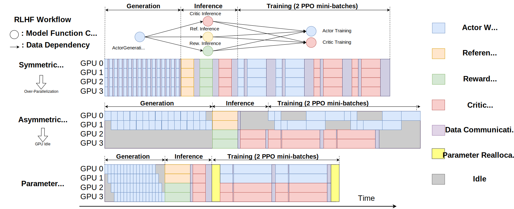

##############
 Introduction
##############

*********************************
 Limitations of Existing Systems
*********************************

We observe two major limitations based on our profiling of the previous
RLHF systems, as shown in the :ref:`timeline`.

.. _timeline:

   Timeline Figure

   Execution timelines of ReaL and existing systems based on profiling.

First, when models are distributed to every GPU node that applies the
same parallelization strategy, such as in `DeepSpeed-Chat
<https://github.com/microsoft/DeepSpeedExamples/tree/master/applications/DeepSpeed-Chat>`_,
it is often over-parallelized. Over-parallelization leads to substantial
synchronization and communication overhead (the light purple bars).

An alternative way is to assign different models to different GPU nodes,
where models can execute concurrently, such as `OpenRLHF
<https://github.com/OpenRLHF/OpenRLHF>`_. However, our second
observation is that such asymmetric parallelization often causes
under-utilization of the GPUs (e.g., the gray areas) because of the
dependencies between tasks.

The key idea of ReaL is to enable dynamic **reallocation of model
parameters** between GPUs to improve the efficiency of the entire RLHF
training process.

By first choosing a parallelization strategy tailored for each
computation workload (e.g., pipelining for Generation and tensor
parallelism for Training) and then executing these calls concurrently
with a smaller parallelization degree (e.g., Actor and Critic in
Training), we can eliminate redundant communication while maximizing GPU
utilization, effectively addressing the limitations of prior solutions.

************************
 Performance Comparison
************************

We show throughput comparison with the state-of-the-art open-source
systems in the following figure.

(In the following figure, as the number of GPUs increases, the model
size scales up from LLaMA 7B, LLaMA 13B, and CodeLLaMA 34B, to the
largest LLaMA 70B.)

.. image:: images/vws.svg

.. _est_time_table:

+--------------+---------------+---------------+---------------+
| System       | DeepSpeedChat | OpenRLHF      | ReaL          |
+==============+===============+===============+===============+
| Time (hours) | 141.5         | 152.8         | **17.0**      |
+--------------+---------------+---------------+---------------+

We also show the estimated time for completing the entire full-scale
4*70B RLHF training process, composed of 4 iterations with 400 steps for
each iteration as for LLaMA-2.

..
   "Scale Actor" maintains the sizes

..
   of Critic and Reward at 7B while increasing the sizes of Actor and Reference with the number of GPUs.

..
   "Scale Critic" follows the opposite approach, and

..
   "Scale Both" increases sizes of all models proportionately.
