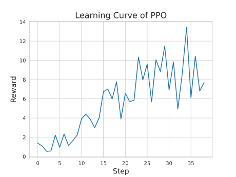

Quickstart
===========

Installation
---------------

First, clone the ReaL repository from GitHub and follow the installation instructions in :doc:`install`.
The following tutorial will run on a GPU machine in the repository directory.

RLHF with 4x LLaMA-7B in 30min
------------------------------------------------

If you are not familiar with the procedure of RLHF,
please refer to the `InstrctGPT paper <https://arxiv.org/abs/2203.02155>`_.
This tutorial will cover the main stages of RLHF,
including SFT, reward modeling, and PPO.

.. note::

    If you have not prepared a dataset for your application, you can download our
    `sample dataset <https://drive.google.com/drive/folders/1xWIJ9DRLNQZxDrkCfAPE12euLLuWQGE-?usp=sharing>`_
    to follow this tutorial.
    The sample dataset is used for controlled sentiment generation,
    where the LLM learns to generate positive movie comments given a context.

    All example scripts with detailed explanations can be found in the
    ``examples/scripts/`` directory.

    If you want to find more details about the configuration options,
    please check :doc:`expconfig`.

Stage 1: Supervised Fine-Tuning
~~~~~~~~~~~~~~~~~~~~~~~~~~~~~~~

Prepare your customized dataset in a JSON or JSONL format,
where each entry is a dictionary with two keys: "prompt" and "answer".
For example:

.. code-block:: json

    {"prompt": "What is the capital of France?", "answer": "The capital of France is ..."}
    {"prompt": "Please make a travel plan for visiting Berlin?", "answer": "..."}

.. note::

    In our provided sample,
    ``sft_pos-train.jsonl`` and ``sft_pos-valid.jsonl`` are the training and validation sets for SFT, respectively.

Run the following command to fine-tune the model on your dataset:

.. code-block:: shell

    $ python3 -m realhf.apps.quickstart sft \
        experiment_name=quickstart-sft \
        trial_name=release \
        allocation_mode=manual \
        mode=local \
        n_nodes=1 \
        exp_ctrl.total_train_epochs=8 \
        exp_ctrl.save_freq_steps=50 \
        exp_ctrl.eval_freq_epochs=1 \
        model.type._class=llama \
        model.path=/path/of/llama-7b \
        dataset.train_path=/path/to/train/dataset.jsonl \
        dataset.valid_path=/path/to/valid/dataset.jsonl \
        dataset.max_seqlen=1024 \
        allocation.parallel.pipeline_parallel_size=1 \
        allocation.parallel.model_parallel_size=2 \
        allocation.parallel.data_parallel_size=4 \
        dataset.train_bs_n_seqs=512 \
        dataset.valid_bs_n_seqs=512

.. note::

    ReaL adopts `structured configurations <https://hydra.cc/docs/tutorials/structured_config/intro/>`_
    in `Hydra <https://hydra.cc/>`_ to manage command line options.
    The options in the above command correspond to a Python
    dataclass object: :class:`realhf.SFTConfig`.
    The attributes, including the model type, learning rate, and parallel strategy,
    can be recursively overwritten via command line options.
    Please check :doc:`expconfig` for more details.

    As a reminder, the value `null` should represent `None` in Python.

The user can specify the number of nodes and the parallel strategy to use with
the above command, in addition to paths and hyperparameters.
In the given example, the experiment will use 1 node
(assuming each node has 8 GPUs, implicitly set by the ``n_gpus_per_node`` attribute),
with a parallel strategy (pipe=1, tensor=2, data=4) and a batch size of 512.

After the experiment has been successfully launched,
you will see the training logs in the console like this:

.. code-block:: console

    20240618-03:10:56.216 quickstart INFO: Running sft experiment.
    20240618-03:10:56.216 quickstart INFO: Logs will be dumped to /lustre/aigc/llm/logs/fw/quickstart-sft/release
    20240618-03:10:56.216 quickstart INFO: Model checkpoints will be saved to /lustre/aigc/llm/checkpoints/fw/quickstart-sft/release
    ...

The above output shows the log and checkpoint paths of this experiment,
according to the given ``experiment_name`` and ``trial_name``.
You can check the logs:

.. code-block:: console

    $ ls /lustre/aigc/llm/logs/fw/quickstart-sft/release/
    ctl-0            master_worker-0  time_marks0.pkl  time_marks2.pkl  time_marks4.pkl  time_marks6.pkl  
    hydra-outputs/   model_worker-0   time_marks1.pkl  time_marks3.pkl  time_marks5.pkl  time_marks7.pkl
    $ # Check the training statistics like loss and running time in the master worker.
    $ cat /lustre/aigc/llm/logs/fw/quickstart-sft/release/master_worker-0
    $ # Check the runtime system metrics in the model worker.
    $ cat /lustre/aigc/llm/logs/fw/quickstart-sft/release/model_worker-0

You can also check the checkpoints:

.. code-block:: console

    $ ls /lustre/aigc/llm/checkpoints/fw/quickstart-sft/release/default/epoch7epochstep5globalstep50/
    config.json                       pytorch_model-00007-of-00014.bin  pytorch_model-00014-of-00014.bin
    pytorch_model-00001-of-00014.bin  pytorch_model-00008-of-00014.bin  pytorch_model.bin.index.json
    pytorch_model-00002-of-00014.bin  pytorch_model-00009-of-00014.bin  special_tokens_map.json
    pytorch_model-00003-of-00014.bin  pytorch_model-00010-of-00014.bin  tokenizer.json
    pytorch_model-00004-of-00014.bin  pytorch_model-00011-of-00014.bin  tokenizer.model
    pytorch_model-00005-of-00014.bin  pytorch_model-00012-of-00014.bin  tokenizer_config.json
    pytorch_model-00006-of-00014.bin  pytorch_model-00013-of-00014.bin

Here, ``default`` is the model name. Since we would save multiple models for algorithms like PPO,
the model name is used to distinguish different models.
SFT has a single model named ``default``.

The directory suffix indicates the step of this checkpoint.
It's the checkpoint after 50 training steps at step 5 of epoch 7 (we have set ``save_freq_steps=50``).
You can change the save frequency by modifying the ``exp_ctrl`` attribute in :class:`realhf.SFTConfig`.

.. note::

    ReaL directly loads from HuggingFace models and also saves checkpoints
    as HuggingFace models, making it convenient to use pre-trained checkpoints
    and to deploy trained models with inference frameworks like vLLM.

    You can directly pass the path of the above checkpoint to
    ``transformers.AutoModelForCausalLM.from_pretrained`` or vLLM to load the model.

.. image:: images/sft_loss.svg
    :align: center

.. code-block:: console

    $ cat /lustre/aigc/llm/logs/fw/quickstart-sft/release/master_worker-0
    ...
    0: 20240618-13:32:19.081 master worker INFO: Execution finished!
    0: 20240618-13:32:19.083 master worker INFO: Epoch 8/8 step 7/7 ... Total time consumption: 628.051s. ...
    ...
    0: 20240618-13:32:34.906 master worker INFO: Execution finished!
    0: 20240618-13:32:34.906 master worker INFO: Training complete! Yeah!!!

The SFT experiment will take about 10 minutes to finish 
using our provided dataset and configuration.
Let's move on to the next stage.

Stage 2.1: Reward Modeling (RM)
~~~~~~~~~~~~~~~~~~~~~~~~~~~~~~~

Prepare your customized dataset in a JSON or JSONL format,
where each entry is a dictionary with three keys:
"prompt", "pos_answer", and "neg_answers".

"prompt" should be a string, while "pos_answer" and "neg_answers"
should be lists of strings of the same size, forming pairwise comparisons.

.. note::

    In our provided sample,
    ``rm_paired-train.jsonl`` and ``rm_paired-valid.jsonl`` are the 
    training and validation sets for reward modeling, respectively.

Run the following command to train the reward model:

.. code-block:: shell

    $ python3 -m realhf.apps.quickstart rw \
        experiment_name=quickstart-rw \
        trial_name=release \
        mode=local \
        allocation_mode=manual \
        exp_ctrl.total_train_epochs=1 \
        exp_ctrl.save_freq_steps=5 \
        exp_ctrl.eval_freq_epochs=1 \
        model.type._class=llama \
        model.type.is_critic=True \
        model.path=/saved/sft/model/path \
        allocation.parallel.pipeline_parallel_size=2 \
        allocation.parallel.model_parallel_size=2 \
        allocation.parallel.data_parallel_size=2 \
        dataset.train_path=/path/to/train/dataset.jsonl \
        dataset.valid_path=/path/to/valid/dataset.jsonl \
        dataset.max_pairs_per_prompt=2 \
        dataset.max_seqlen=1024 \
        dataset.train_bs_n_seqs=512 \
        dataset.valid_bs_n_seqs=512

It's a common practice to use the SFT model to initialize the reward model.
Therefore, we can pass the path of the saved SFT model as ``model.path``.
Using the pre-trained LLaMA checkpoint is also feasible, but it may not
perform as well as the SFT checkpoint.

In reward modeling, the batch size is the number of paired comparisons.
With a batch size of 512, there will be 512 positive samples and 512 negative samples in each batch.

.. code-block:: console

    $ bash examples/scripts/rw.sh
    0: 20240618-13:52:00.094 master worker INFO: Running rw experiment.
    0: 20240618-13:52:00.094 master worker INFO: Logs will be dumped to /lustre/aigc/llm/logs/fw/quickstart-rw/release
    0: 20240618-13:52:00.094 master worker INFO: Model checkpoints will be saved to /lustre/aigc/llm/checkpoints/fw/quickstart-rw/release
    ...

The log and checkpoint paths are similar to that of SFT,
except that the experiment name and trial name can be changed.
Note that the saved RW checkpoint is not loadable by HuggingFace or vLLM,
because the projection head has been replaced by a linear layer that outputs a scalar.

.. image:: images/rw_loss.svg
    :align: center

Training the reward model to convergence can be very fast.
In the given example, we can stop the training after 15 steps,
which takes approximately 5 minutes.

.. code-block:: console

    0: 20240618-13:53:00.094 master worker INFO: Epoch 1/1 step 15/26 (global step 15) finishes. ... Total time consumption: 294.393s.

Stage 2.2: Direct Preference Optimization (DPO)
~~~~~~~~~~~~~~~~~~~~~~~~~~~~~~~~~~~~~~~~~~~~~~~~

Besides the ordinary RLHF procedure with PPO,
ReaL also supports the `DPO algorithm <https://arxiv.org/abs/2305.18290>`_, 
which avoids reward modeling.

The dataset for DPO is exactly the same as for reward modeling.

Run the following command to train using DPO:

.. code-block:: shell

    $ python3 -m realhf.apps.quickstart dpo \
        experiment_name=quickstart-dpo \
        trial_name=release \
        allocation_mode=manual \
        mode=local \
        exp_ctrl.total_train_epochs=2 \
        exp_ctrl.save_freq_steps=5 \
        actor.type._class=llama \
        actor.path=/saved/sft/model/path \
        actor_train.parallel.pipeline_parallel_size=1 \
        actor_train.parallel.model_parallel_size=4 \
        actor_train.parallel.data_parallel_size=2 \
        actor_train.parallel.use_sequence_parallel=True \
        ref.type._class=llama \
        ref.path=/saved/sft/model/path \
        ref_inf.parallel.pipeline_parallel_size=1 \
        ref_inf.parallel.model_parallel_size=2 \
        ref_inf.parallel.data_parallel_size=4 \
        ref_inf.parallel.use_sequence_parallel=True \
        dataset.train_path=/path/to/train/dataset.jsonl \
        dataset.max_seqlen=1024 \
        dataset.train_bs_n_seqs=512 \
        dataset.valid_bs_n_seqs=512

Note that there's a major difference between DPO and SFT/RM.
DPO involves two different models, the *actor* and the *reference*.
The former is the primary LLM to be trained and the latter is the frozen SFT
model to provide KL regularizations.

A training iteration of DPO is composed of two steps:

- *RefInf*: The reference model performs a forward step to compute the log probabilities of positive and negative answers.

- *ActorTrain*: Given the reference log probabilities, the actor model computes the DPO loss, runs the backward pass, and updates the parameters.

In ReaL, these two steps can run with different parallel strategies, maximizing the efficiency of the individual workloads.
These parallel strategies can be specified in the ``ref_inf`` and ``actor_train`` fields.
Specifically, pipelined inference can be faster than tensor-paralleled inference due to
the reduced communication overhead, so assigning a relatively large ``pipeline_parallel_size``
for ``ref_inf`` can be favorable.

Moreover, ReaL can automatically *offload* the parameters of the reference model once *RefInf* is done.
This offloading fully supports 3D parallelism and does not require DeepSpeed ZeRO-3 or any additional configurations.
Consequently, **ReaL's DPO is as memory-efficient as training a single model like SFT!**

Stage 3: PPO
~~~~~~~~~~~~~~~~~

After the SFT and RM stages, we can proceed to the PPO stage.
The dataset for PPO should be a JSON or JSONL file with each entry being a dictionary with a single key "prompt".

.. note::

    In our provided sample,
    ``ppo_prompt.jsonl`` is the training set for PPO.

Run the following command to train using PPO:

.. code-block:: shell

    $ python3 -m realhf.apps.quickstart ppo \
        experiment_name=quickstart-ppo \
        trial_name=release \
        exp_ctrl.total_train_epochs=1 \
        exp_ctrl.save_freq_steps=null \
        allocation_mode=heuristic \
        actor.type._class=llama \
        actor.path=/saved/sft/model/path \
        critic.type._class=llama \
        critic.type.is_critic=True \
        critic.path=/saved/rw/model/path \
        critic.gradient_checkpointing=True \
        ref.type._class=llama \
        ref.path=/saved/sft/model/path \
        rew.type._class=llama \
        rew.type.is_critic=True \
        rew.path=/saved/rw/model/path \
        dataset.path=/path/to/prompt/dataset.jsonl \
        dataset.max_prompt_len=256 \
        dataset.train_bs_n_seqs=128 \
        ppo.gen.max_new_tokens=256 \
        ppo.gen.min_new_tokens=256 \
        ppo.ppo_n_minibatches=4 \
        ppo.kl_ctl=0.1 \
        ppo.value_eps_clip=0.2 \
        ppo.reward_output_scaling=10.0 \
        ppo.adv_norm=True ppo.value_norm=True \
        ppo.top_p=0.9 ppo.top_k=1000

.. note::

    You can also pass in the trained DPO checkpoint to initialize the PPO policy.

The configuration options of PPO are the most complex among the three stages.
PPO involves four different models: *Actor*, *Critic*, *Reference*, and *Reward*.
Each model can have different functionalities across a training iteration.
For example, the *Actor* should first *generate* responses given prompts and then
be *trained* given rewards, values, and KL regularizations.

Training iterations of PPO can be illustrated as follows:

.. image:: images/rlhf_dfg.svg
    :alt: Dataflow graph of RLHF.
    :align: center

We can see that there are six distinct *function calls* on these four models.
In ReaL, these function calls can have independent *allocations* and *parallel strategies*.
Each GPU can accommodate parameter shards of multiple models (e.g., both the Actor and the Reward).
Between two function calls upon the same model, ReaL will automatically re-allocate
model parameters between source and destination locations and properly remap
parallel strategies.

.. The reallocation also includes GPU-to-CPU reallocation, referred to as *offloading*.

This technique can substantially reduce communication overhead caused by parallelization
and improve GPU utilization.
Please check :doc:`intro` for more details.

In the above command, fields ``actor``, ``critic``, ``ref``, and ``rew``
specify the configurations of the four models.
The allocations and parallel strategies for function calls are automatically
handled by the ``heuristic`` allocation mode.
This is a near-optimal execution strategy found by the search engine in ReaL.

For the details of PPO hyperparameters in the ``ppo`` field, please check
:class:`realhf.PPOHyperparameters` for a detailed explanation.

.. code-block:: console

    0: 20240618-14:46:38.007 master worker INFO: Epoch 1/1 step 39/39 (global step 39) finishes. ... Total time consumption: 574.312s. ...
    ...
    0: 20240618-14:46:54.387 master worker INFO: Execution finished!
    0: 20240618-14:46:54.387 master worker INFO: Training complete! Yeah!!!

We train PPO on 5000 prompts over 1 epoch, which consumes about 10 minutes.
Summing up the time of the three stages, we can finish the RLHF process **within half an hour!**
This efficiency can largely help algorithm developers to search for the best hyperparameters
and iterate on the algorithm design.
